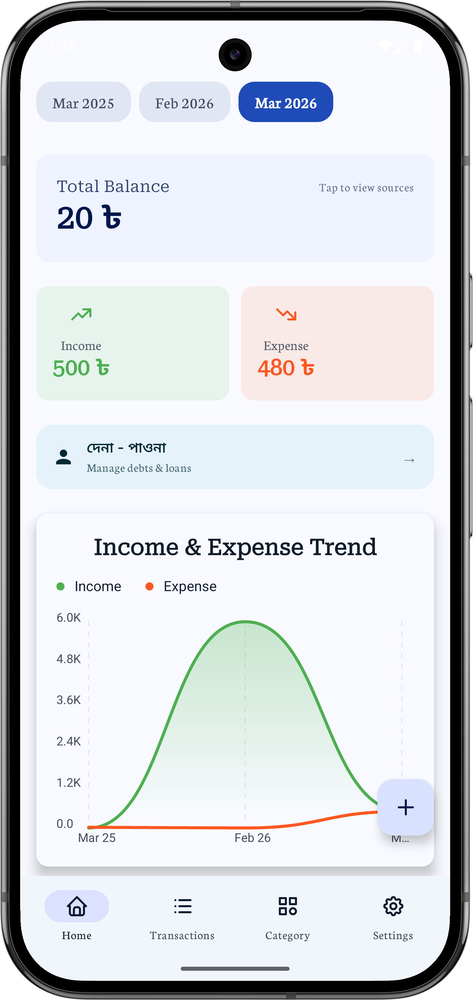
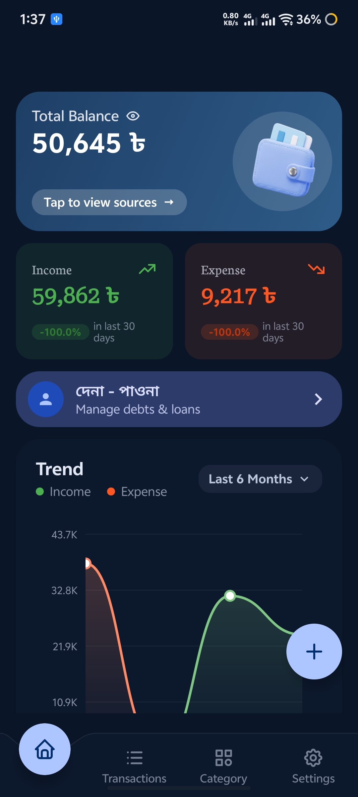
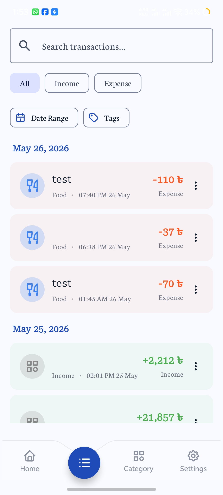
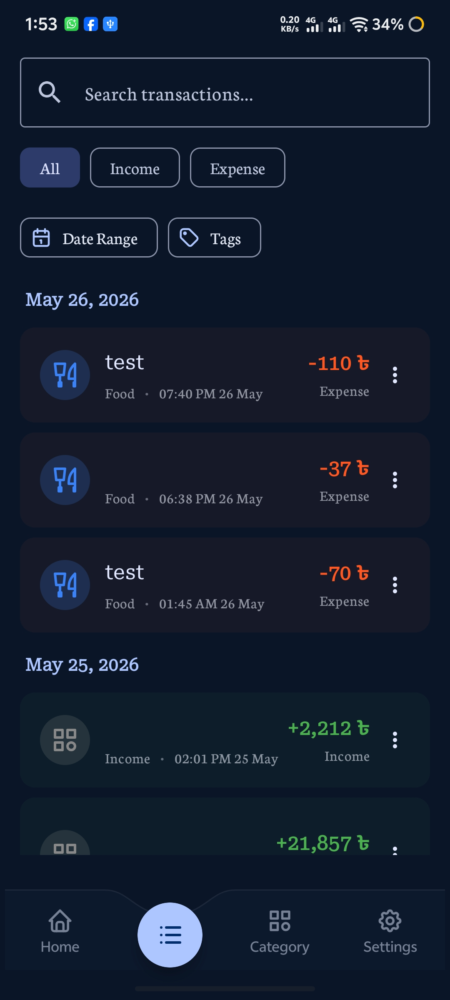
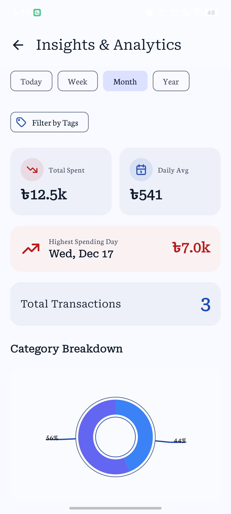
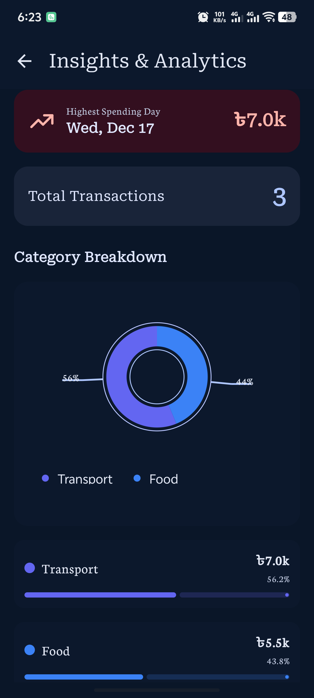
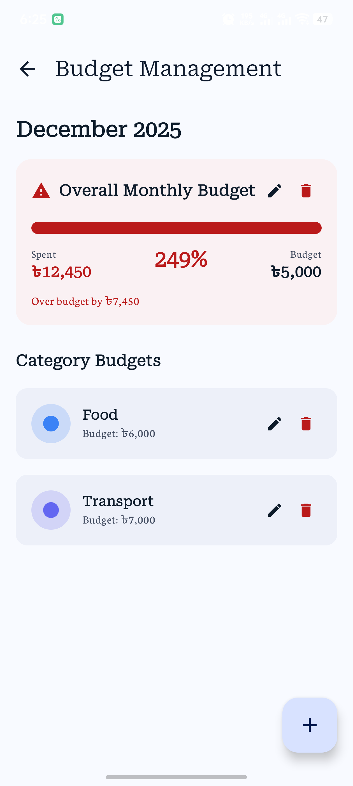
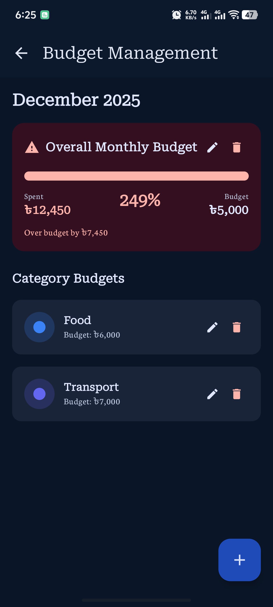
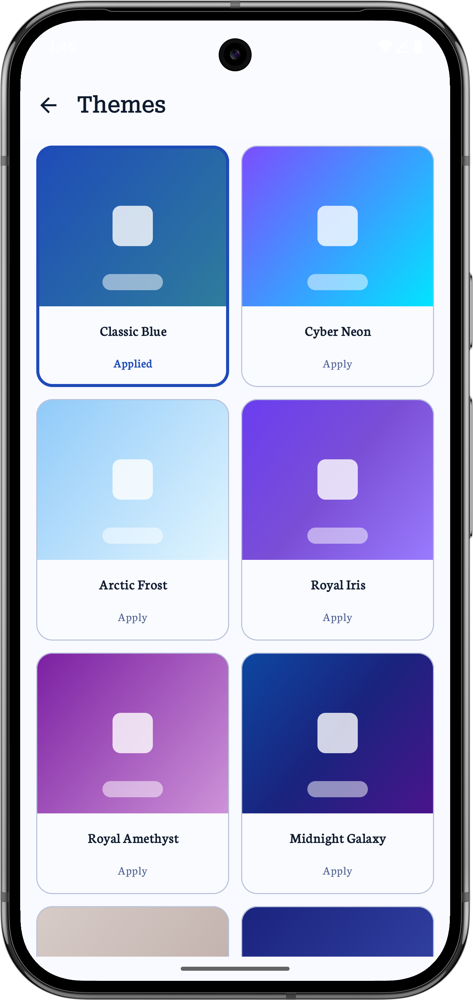
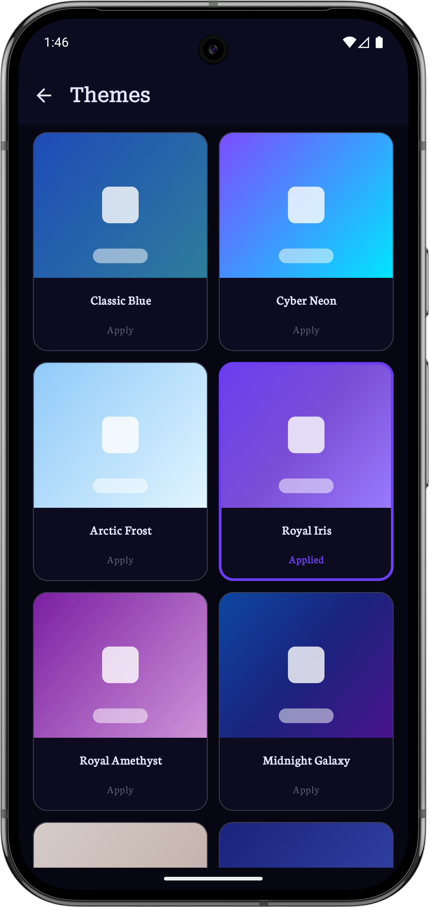

# 💰 Expense Tracker

A beautiful and feature-rich expense tracking app built with Jetpack Compose, offering comprehensive financial management with a modern Material 3 design.

## 🚀 Download

---

## ✨ Features

### 📊 Comprehensive Financial Management
- **Track Income & Expenses** - Effortlessly record and monitor every financial transaction.
- **Visual Analytics** - Dynamic **Line Charts** and beautiful **Pie Charts** for detailed trend analysis and expense breakdowns.
- **Budgeting** - Set monthly spending limits for the whole app or specific categories with real-time tracking and visual warnings.
- **Smart Search & Filters** - Quickly find transactions by amount, category, description, notes, tags, or specific date ranges.

### 🤝 Debt & Loan Management (দেনা-পাওনা)
- **Profile-Based Tracking** - Organize your lending and borrowing transactions by person/profile.
- **History & Filtering** - Detailed record for each profile with advanced filtering (Debt, Loan, All).
- **Net Balance Visibility** - Color-coded status updates ("You'll Get", "You'll Pay", "Settled") for instant financial clarity.
- **Full Control** - Seamlessly add, edit, or delete debt records with intuitive dialogs.

### 🏦 Balance Source Organization (Wallets/Accounts)
- **Multi-Source Support** - Distribute your balance across various virtual or physical sources like Bank, Bkash, Nagad, Cash, or Binance.
- **Instant Fund Transfers** - Move money between sources effortlessly with a dedicated transfer log and descriptive notes.
- **Account Summaries** - View individual current balances and descriptive details for every financial source independently.

### 🎨 Premium User Experience & Personalization
- **16+ Premium Themes** - Choose from a wide variety of professionally curated themes (e.g., Sunset Glow, Cyber Neon, Arctic Frost).
- **Material 3 Design** - Modern, clean, and intuitive interface with seamless Dark/Light mode support and dynamic coloring.
- **Calculator-Based Input** - Natural expense entry with direct expression support (e.g., `200 + 50`) and live previews.
- **Custom Categories** - Personalize categories with a beautiful color picker and a wide selection of icons.

### 🔒 Security, Privacy & Control
- **App Lock** - Protect your financial data with a secure 4-digit PIN or **Biometric (Fingerprint)** authentication.
- **Soft Delete & Trash** - Deleted items are moved to Trash for 30 days, allowing easy restoration of accidentally removed records.
- **Offline-First** - Works completely offline; your sensitive financial data never leaves your device and no internet is required.
- **Secure Storage** - Local data persistence using Room with optimized queries and indexing.

### 📤 Backup & Data Portability
- **JSON Export & Import** - Full backup and restoration of all application data with schema version checking.
- **CSV Export** - Export your transaction history to Excel-compatible files for external analysis.
- **Duplicate Prevention** - Choose to Skip, Merge, or Overwrite duplicates during the import process.

---

## 📱 Screenshots

### Home Screen
| Light Mode | Dark Mode |
|:---:|:---:|
|  |  |

### Transaction Screen
| Light Mode | Dark Mode |
|:---:|:---:|
|  |  |

### Analytics Screen
| Light Mode | Dark Mode |
|:---:|:---:|
|  |  |

### Budget Screen
| Light Mode | Dark Mode |
|:---:|:---:|
|  |  |

### Themes
| Light Mode | Dark Mode |
|:---:|:---:|
|  |  |
---

## 🏗 Tech Stack

- **UI Framework**: Jetpack Compose (Material 3)
- **Language**: Kotlin
- **Architecture**: MVI / Clean Architecture
- **Dependency Injection**: Koin
- **Database**: Room (Offline-first)
- **Navigation**: Type-Safe Compose Navigation
- **Icons & Graphics**: Vecto Library

## 📄 License

This project is licensed under the MIT License - see the [LICENSE](LICENSE) file for details.

## 📧 Contact

If you have any questions or suggestions, feel free to reach out:

- GitHub: [@0xJihan](https://github.com/0xJihan)

---

⭐ If you found this project helpful, please give it a star on GitHub!
